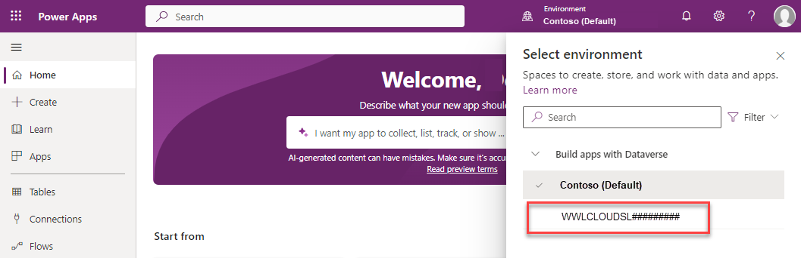

---
lab:
  title: 'مسار التعليم 1 - التمرين العملي 1.1: العمل مع تطبيقات مشاركة العملاء'
  learning path: Explore the core capabilities of Microsoft Dynamics 365 customer engagement apps
  module: Describe the foundations of Dynamics 365 customer engagement apps
---

مسار التعليم 1 - الوحدة 1: وصف أسس تطبيقات Dynamics 365 Customer Engagement
========================

## معمل التدريب 1.1 - العمل مع تطبيقات مشاركة العملاء 

## الأهداف

في هذا التمرين، سوف تتعرف على كيفية الوصول إلى تطبيقات Dynamics 365 Customer Engagement المختلفة والتنقل بينها. 

## إعداد المعمل

  - **الوقت المُتوقع**: 10 دقائق

## الإرشادات

1. في مستعرض الويب، انتقل إلى [https://make.powerapps.com](https://make.powerapps.com/). 

2. سجّل الدخول باستخدام بيانات الاعتماد المقدمة لك من قبل مدربك. عند تسجيل الدخول لأول مرة، سيتم نقلك إلى بيئة **Contoso (الافتراضية)**. عادة، لن تعمل في البيئة الافتراضية. سنُغيرها إلى بيئة مخصصة للتدريب. 

3.  باستخدام محدد البيئة في الأعلى، حدد البيئة **Contoso (افتراضي).** 

4. من القائمة التي تظهر، حدد بيئة التدريب المخصصة التي ذكرها مُدرسك. (بالنسبة لمستأجري التدريب المستضافين، فمن المرجح أن تبدأ البيئة بشيء مثل **WWLCLOUD.**)

5. بمجرد العمل في البيئة الصحيحة، باستخدام التنقل على اليسار، حدد **التطبيقات**. 

6. في قائمة **التطبيقات**، افتح تطبيق **مركز المبيعات**. عندما تكون داخل التطبيق، ستكون هناك مجالات مختلفة يمكنك العمل معها استنادًا إلى ما تحاول القيام به. على سبيل المثال، يحتوي تطبيق Sales Hub على إعدادات إدارية مختلفة يمكنك العمل بها.

7. في الجانب السفلي الأيسر من الشاشة، أسفل جزء التنقل الأيسر أو **خريطة الموقع**، حدد النص **المبيعات**، ومن القائمة التي تظهر، حدد **إعدادات التطبيق.** **إعدادات التطبيق** هي المكان الذي يمكنك من خلاله مراجعة الإعدادات الإدارية وإجراء تغييرات عليها. لاحظ كيف تغيرت عناصر التنقل اليسرى.

8. حدد مُحدد **تغيير المنطقة** مرة أخرى وقم بتغييره من **إعدادات التطبيق** مرة أخرى إلى **المبيعات**.

9. إذا كنت تريد التبديل من تطبيق المبيعات إلى تطبيق مختلف مثل مساحة عمل "خدمة العملاء"، فحدد النص **مركز المبيعات** في الجزء العلوي الأيسر من الشاشة بجوار النص Dynamic 365.

10.  ستظهر النافذة المنبثقة لمحدد **التطبيقات**، حدد **مركز خدمة العملاء** وسيتم نقلك إلى تطبيق **مركز خدمة العملاء**. لاحظ أن **مركز خدمة العملاء** به مناطق مختلفة متاحة في قائمة **تغيير المنطقة**.

11. للتبديل مرة أخرى إلى تطبيق **مركز المبيعات**، حدد النص **مركز خدمة العملاء** في الجزء العلوي والذي يفتح نافذة محدد **التطبيقات** المنبثقة. حدد **مركز المبيعات**.
بدلًا من ذلك، يمكنك الوصول إلى تطبيقات الأعمال من مدخل المكتب. 

12. في مستعرض الويب، انتقل إلى [https://www.office.com/apps](https://www.office.com/apps). سيتم عرض جميع التطبيقات التي يمكنك الوصول إليها.

13. حدد علامة التبويب **Business Apps** للحد من التطبيقات التي يتم عرضها لإظهار تطبيقات Dynamics 365 للأعمال فقط.

14. لتقليل عدد التطبيقات التي يتم عرضها، حدد حقل "بحث" الموجود في الشاشة العلوية.

15. اكتب النص **مركز المبيعات** وحدد تطبيق **مركز المبيعات** لفتحه.

16. عندما تكون داخل التطبيق، ستكون هناك مجالات مختلفة يمكنك العمل معها استنادًا إلى ما تحاول القيام به. على سبيل المثال، يحتوي تطبيق Sales Hub على إعدادات إدارية مختلفة يمكنك العمل بها.

17. في الجانب السفلي الأيمن من الشاشة، حدد النص **Sales**، ومن القائمة التي تظهر، حدد **App Settings**. هذا الجزء من التطبيق هو المكان الذي يمكنك إجراء تغييرات إدارية عليه.

18. حدد مُحدد المنطقة مرة أخرى وغيّره من **إعدادات التطبيق** مرة أخرى إلى **المبيعات**.

19. إذا كنت تريد التبديل من تطبيق المبيعات إلى تطبيق آخر مثل "مركز خدمة العملاء"، فحدد النص **مركز المبيعات** في الجزء العلوي الأيسر من الشاشة بجوار النص Dynamic 365.

20. ستظهر شاشة التطبيقات، حدد **مركز خدمة العملاء** وسيتم نقلك إلى تطبيق "مركز خدمة العملاء".

21. حدد النص **مركز خدمة العملاء** في الجزء العلوي للتبديل مرة أخرى إلى تطبيق **مركز المبيعات**.
